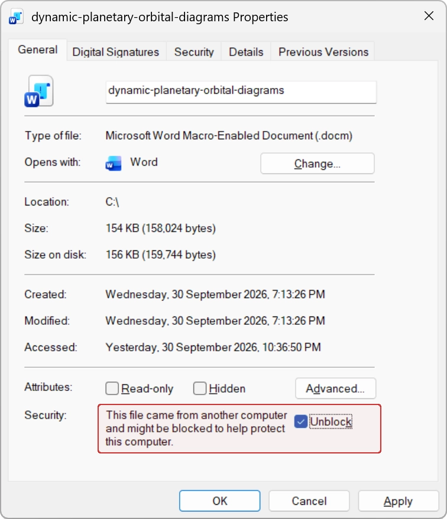

# Dynamic Planetary Orbital Diagrams with Microsoft Word VBA

 

This repository holds digital resources associated with the article "Dynamic
Planetary Orbital Diagrams with Microsoft Word VBA" [[1](#references)]. That
article discusses an automatically-updating orbital diagram of the Solar
System's planets in a Word document. A rendering routine was built with Visual
Basic for Applications (VBA), the scripting language built into Microsoft's
Office suite. Every time the document is opened, current planetary positions
are recalculated, and the orbital diagram updated accordingly.

---

<figure>
  <picture>
    <source media="(prefers-color-scheme: dark)"
    srcset="assets/dynamic-planetary-orbital-diagrams-dm.svg">
    
  </picture>
   
  <figcaption>Figure 1. The anticlockwise orbits of the Solar System's planets
  viewed from the J2000 north ecliptic pole at JD 2460952 (03-Oct-2025, 12 PM,
  UTC). The J2000 vernal equinox forms the Cartesian x-axis (horizontal, right
  oriented). Open circles at the centre of the diagrams represent the Sun. The
  small, filled circles represent planets. Left: the orbits of Mercury, Venus,
  the Earth-Moon barycentre and Mars, in order of increasing orbital radius.
  Right: the orbits of Jupiter, Saturn, Uranus, Neptune and Pluto, again in
  order of increasing orbital radius. Lengths are denoted in astronomical units
  (AU). Solar and planetary radii aren't rendered to scale. Adapted from
  [<a href="#references">1</a>].</figcaption>
</figure>

---

## Table of Contents

- [Key Files](#key-files)
- [Software Requirements](#software-requirements)
- [Quality Assurance](#quality-assurance)
- [Getting Started](#getting-started)
- [Acknowledgements](#acknowledgements)
- [References](#references)
- [Citation](#citation)
- [License](#license)

## Key Files

| File                                          | Notes                        |
| :-------------------------------------------- | :--------------------------- |
| `src/dynamic-planetary-orbital-diagrams.docm` | Macro-enabled Word document. |

## Software Requirements

| Software                           | Notes                                                                                                                                                                    |
| :--------------------------------- | :----------------------------------------------------------------------------------------------------------------------------------------------------------------------- |
| Microsoft Word &nbsp; &nbsp; | [Available here](https://www.microsoft.com/). Proprietary. &nbsp;&nbsp;&nbsp;Desktop app supported. &nbsp;&nbsp;&nbsp;Browser and mobile versions are unsupported. |

## Quality Assurance

The orbital diagrams generator has been tested in the following environment.

Windows Test Environment

 

| Type               | Component                | Version                                                                                                |
| :----------------- | :----------------------- | :----------------------------------------------------------------------------------------------------- |
| Platform           | Operating system         | Windows 11, 26H2 (OS Build 26300.9550)                                                                 |
| Software &nbsp; | Microsoft Word &nbsp; | Microsoft Word for Microsoft 365 MSO &nbsp;&nbsp;&nbsp;Version 2608, Build 16.0.20326.20072, 64-bit |

## Getting Started

The file `dynamic-planetary-orbital-diagrams.docm` should be opened in Word.
The planetary orbital diagrams will be updated automatically.

> [!NOTE]
> The VBA code is computationally intensive, so the document can be slow to
> open. Waiting a few minutes may be necessary before Word completes
> processing.

### Managing Macros

Macro-enabled content must be active in Word to render dynamic diagrams.

Additionally, Windows may block the document's macros. To resolve this, right
click on the file to open Document Properties. Go to the General tab, Security
section and select the Unblock checkbox.

## Acknowledgements

Google Gemini [[2](#references)] was used as an assistive tool to provide
performance tuning tips.

## References

1. T. N. Stenborg, "Dynamic Planetary Orbital Diagrams with Microsoft Word VBA",
   in _Astron. Data Anal. Softw. Syst. XXXIV_, in Astronomical Society of the
   Pacific Conference Series (in press).

2. _Google Gemini_. (Large language model, October 2026 release). Google.
   [Online]. Available: [google.com](https://www.google.com/).

## Citation

Citation details are available by clicking **Cite this repository** in the
GitHub sidebar.

## License

This repository is licensed under the BSD-3-Clause license. Details are
available in the [LICENSE](./LICENSE) file.
